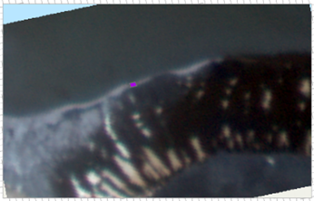

# Walrus_from_space


This GitHub is the code used for the Masters of Research Project, titled:

### **Walrus From Space: Monitoring Walrus Haul-out Sites with Satellite Imagery**

---

<!-- TOC -->
* [Walrus_from_space](#walrus_from_space)
  * [Acknowledgements](#acknowledgements)
  * [License](#license)
  * [Use](#use)
    * [Installing dependencies](#installing-dependencies)
  * [Where to start? / Main files to explore](#where-to-start--main-files-to-explore)
  * [Structure](#structure)
    * [Data](#data)
    * [Plots](#plots)
    * [Notebooks](#notebooks)
  * [Results](#results)
    * [PCA](#pca)
    * [Class imbalance stats](#class-imbalance-stats)
    * [Model Comparison](#model-comparison)
    * [Random Forest](#random-forest)
    * [Ensemble Model](#ensemble-model)
  * [Data Folder Structure](#data-folder-structure)
<!-- TOC -->

---

## Acknowledgements

This project is made in collaboration with the `University of Cambridge` and the `British Antarctic Survey`.  
This project also used data owned by [Planet](https://www.planet.com/).

## License

The LICENSE _**ONLY**_ covers the notebooks.
All and any satellite images that are present in any of the notebooks or the folder plots are not part of that LICENSE.
In other words _**ONLY**_ the code is covered by the LICENSE, the rest is not.

---

## Use
### Installing dependencies

To install the dependencies in a virtual environment of your choice.

```shell
pip install -r requirement.txt
```
---

## Where to start? / Main files to explore

[`1_open_explore_data/1.1_data_analysis`](./notebooks/1_open_explore_data/1.1_data_analysis) all the files here to understand the data.  
[`1_open_explore_data/1.2_image_enhancement/image_enhancement.ipynb`](./notebooks/1_open_explore_data/1.2_image_enhancement/image_enhancement.ipynb)
to explore the different image manipulation.  

[`2_spectral_profiles/spectral_analysis`](./notebooks/2_spectral_profiles/spectral_analysis.ipynb) for all the spectral 
and understanding the preprocessing steps for the creation of the training data.  
[`2_spectral_profiles/image_enhance_spectral_differences.ipynb`](./notebooks/2_spectral_profiles/image_enhance_spectral_differences.ipynb) 
for the analysis and comparison between the different classes in spectral profiles, and shows **Fisher's discriminant**. 

[`3_class_imbalance/class_imbalance_using_spectral`](./notebooks/3_class_imbalance/class_imbalance_using_spectral.ipynb)
That shows the class imbalance and results for **Welch's t-test**, **ANOVA**, and **Kruskal-Wallis H Test**.  
[`3_class_imbalance/adaptive_smote_test`](./notebooks/3_class_imbalance/adaptive_smote_test.ipynb) for exploration of **SMOTE.**  
[`3_class_imbalance/class_imbalance_ADASYN_allislands`](./notebooks/3_class_imbalance/class_imbalance_ADASYN_allislands.ipynb) 
for **ADASYN**.

[`4_random_forest`](./notebooks/4_random_forest) Different implementation of Random Forest.  
[`4_random_forest/smart_RF_clipped_up_down_samp_allislands`](./notebooks/4_random_forest/smart_RF_clipped_up_down_samp_allislands.ipynb) 
shows Tomek Links under-sampling being used.

[`9_compare_model/`](./notebooks/9_compare_model) Notebooks that compares the models.  
[`9_compare_model/oceanbuffer`](./notebooks/9_compare_model/oceanbuffer.ipynb) to show the use of a multipass, 
first masking the ocean, thus detecting the coast to focus on to find walruses.  


## Structure

### Data
All images used for this study are owned by [Planet](https://www.planet.com/) and therefore can not be made public.


Data should place in a folder called `data`, in the same folder as `notebooks`.  
To run the notebooks yourself, you might to overwrite the paths for the data dir at the beginning of the notebook with
your own.

The data folder structure is explained at the end of the README.md.


### Plots
Some of the save plots from the different notebooks

### Notebooks
The notebooks show all the different explorations taken.
The main structure is the following:  

```
notebooks
│
├── 1_open_explore_data
│   │  This for exploring the data, and a sandbox to understand how to handle the satellite data. 
│   │
│   ├──1.1_data_analysis
│   │       notebooks that looks at the data, as well as some PCA analysis.
│   └──1.2_image_enhancement
│           is for the notebooks that try some classical image enhancement to see if they could work at detecting walruses.
│
├── 2_spectral_profiles
│       Collection of notebooks that shows the spectral analysis and profiles of the different region of interests in the images.
│       As well as exploring what class to group together.
│
├── 3_class_imbalance
│       Explores different way to the class imbalance present, using methods like SMOTE and ADASYN.
│
├── 4_random_forest
│       Mutliple runs of Random Forest, form different preprocessing to location.
│
├── 5_knn
│       Some tries with KNNs.
│
├── 6_xgboost
│       A notebook for the implementation with XGBoost
│
├── 7_ensemble
│       An essemble model, and using some ocean buffer
│
├── 8_cnn
│       Some try at CNNs and UNET
│
└── 9_compare_model
        Multiple notebooks to compare all the different models.
```


## Results
### PCA
`1_open_explore_data/1.1_data_analysis/PCA_Analysis_cluster_labels` which shows some of the PCA of the data.


### Spectral profile and distances
from `2_spectral_profiles/spectral_analysis`, some spectral information.


### Class imbalance stats
`3_class_imbalance/class_imbalance_using_spectral.ipynb`

Multiple Comparison of Means - Tukey HSD, FWER=0.05           

```
   group1       group2     meandiff  p-adj    lower      upper    reject
------------------------------------------------------------------------
  freshwater          ice   681.8746    0.0   672.7801    690.969   True
  freshwater        ocean -1275.9772    0.0  -1284.735 -1267.2194   True
  freshwater         rock  -289.5934    0.0  -299.8182  -279.3686   True
  freshwater walrus_mixed   137.1189    0.0    76.7517   197.4861   True
  freshwater  walrus_pure   408.2282    0.0   160.7795    655.677   True
         ice        ocean -1957.8518    0.0 -1961.5321 -1954.1715   True
         ice         rock   -971.468    0.0  -977.9016  -965.0343   True
         ice walrus_mixed  -544.7557    0.0  -604.5975  -484.9138   True
         ice  walrus_pure  -273.6463 0.0201  -520.9674   -26.3252   True
       ocean         rock   986.3838    0.0   980.4356    992.332   True
       ocean walrus_mixed  1413.0961    0.0  1353.3045  1472.8877   True
       ocean  walrus_pure  1684.2054    0.0  1436.8965  1931.5144   True
        rock walrus_mixed   426.7123    0.0   366.6883   486.7363   True
        rock  walrus_pure   697.8216    0.0   450.4564   945.1869   True
walrus_mixed  walrus_pure   271.1093 0.0289      16.69   525.5287   True
------------------------------------------------------------------------
```
Kruskal-Wallis H:

| Band         |             H-stat | p-value |
|:-------------|-------------------:|--------:|
| Coastal Blue | 396695.54089294106 |     0.0 |
| Blue         |  382913.7400329306 |     0.0 |
| Green1       | 401448.69158046786 |     0.0 |
| Green        | 495364.98787667963 |     0.0 |
| Yellow       |  603380.0017913427 |     0.0 |
| Red          |  665949.4517667058 |     0.0 |
| Red_edge     |   723429.833556239 |     0.0 |
| Nir          |  794831.4159363415 |     0.0 |

Manova:

| Intercept              |  Value | Num DF |       Den DF |    F Value | Pr > F |
|:-----------------------|-------:|-------:|-------------:|-----------:|-------:|
| Wilks' lambda          | 0.7049 | 8.0000 | 1213483.0000 | 63489.4851 | 0.0000 |
| Pillai's trace         | 0.2951 | 8.0000 | 1213483.0000 | 63489.4851 | 0.0000 |
| Hotelling-Lawley trace | 0.4186 | 8.0000 | 1213483.0000 | 63489.4851 | 0.0000 |
| Roy's greatest root    | 0.4186 | 8.0000 | 1213483.0000 | 63489.4851 | 0.0000 |

| C(encoded_labels       |  Value |  Num DF |       Den DF |     F Value | Pr > F |
|:-----------------------|-------:|--------:|-------------:|------------:|-------:|
| Wilks' lambda          | 0.1357 | 40.0000 | 5289452.5612 |  76870.6043 | 0.0000 |
| Pillai's trace         | 1.1144 | 40.0000 | 6067435.0000 |  43504.4206 | 0.0000 |
| Hotelling-Lawley trace | 4.5905 | 40.0000 | 3640435.0001 | 139263.2151 | 0.0000 |
| Roy's greatest root    | 4.1838 |  8.0000 | 1213487.0000 | 634626.7833 | 0.0000 |

### Model Comparison

| Classifier          | Accuracy↑ | Precision↑ | Recall↑ |   F1!↑ |
|:--------------------|----------:|-----------:|--------:|-------:|
| k-NN                |    0.9844 |     0.9841 |  0.9843 | 0.9841 |
| RF                  |    0.9839 |     0.9836 |  0.9839 | 0.9836 |
| XGBoost             |    0.9814 |     0.9811 |  0.9814 | 0.9811 |
| Gradient Boosting   |    0.9707 |     0.9695 |  0.9707 | 0.9696 |
| Logistic Regression |    0.9269 |     0.9166 |  0.9269 | 0.9147 |
| SVM                 |    0.9583 |     0.9515 |  0.9531 | 0.9462 |
| Object-detection    |    0.8789 |     0.8746 |  0.8789 | 0.8739 |

### Random Forest


  


### Ensemble Model


  

  

  


## Data Folder Structure
The structure of `data/train` used throughout this code was as follows, where 'island' is the name of the island in the
image, 'YYYYMMDD' is the date in year month day format of when the image was taken.

```
Folder_name
│
├── clipped_groundtruth
│       island_YYYYMMDD_groundtruth.tfw
│       island_YYYYMMDD_groundtruth.tif
│       island_YYYYMMDD_groundtruth.tif.aux.xml
│       island_YYYYMMDD_groundtruth.tif.ovr
│
├── clipped_images
│       island_YYYYMMDD_image.tfw
│       island_YYYYMMDD_image.tif
│       island_YYYYMMDD_image.tif.aux.xml
│
├── clipped_train
│       island_YYYYMMDD_train.cpg
│       island_YYYYMMDD_train.dbf
│       island_YYYYMMDD_train.prj
│       island_YYYYMMDD_train.sbn
│       island_YYYYMMDD_train.sbx
│       island_YYYYMMDD_train.shp
│       island_YYYYMMDD_train.shp.xml
│       island_YYYYMMDD_train.shx
│
├── clipped_unlabeled
│       island_YYYYMMDD_image.tfw
│       island_YYYYMMDD_image.tif
│       island_YYYYMMDD_image.tif.aux.xml
│
├── island_by_island
│   ├── island_1_groundtruth
│   │       island_YYYYMMDD_groundtruth.tfw
│   │       island_YYYYMMDD_groundtruth.tif
│   │       island_YYYYMMDD_groundtruth.tif.aux.xml
│   │       island_YYYYMMDD_groundtruth.tif.ovr
│   │
│   ├── island_1_image
│   │       island_YYYYMMDD_image.tfw
│   │       island_YYYYMMDD_image.tif
│   │       island_YYYYMMDD_image.tif.aux.xml
│   │
│   ├── island_1_train
│   │       island_YYYYMMDD_train.cpg
│   │       island_YYYYMMDD_train.dbf
│   │       island_YYYYMMDD_train.prj
│   │       island_YYYYMMDD_train.sbn
│   │       island_YYYYMMDD_train.sbx
│   │       island_YYYYMMDD_train.shp
│   │       island_YYYYMMDD_train.shp.xml
│   │       island_YYYYMMDD_train.shx
│   │
│   └── island_1_unseen
│           island_YYYYMMDD_image.tfw
│           island_YYYYMMDD_image.tif
│           island_YYYYMMDD_image.tif.aux.xml
│
└── walrus_shapefiles
        island_YYYYMMDD_walrus.cpg
        island_YYYYMMDD_walrus.dbf
        island_YYYYMMDD_walrus.prj
        island_YYYYMMDD_walrus.sbn
        island_YYYYMMDD_walrus.sbx
        island_YYYYMMDD_walrus.shp
        island_YYYYMMDD_walrus.shp.xml
        island_YYYYMMDD_walrus.shx

```
